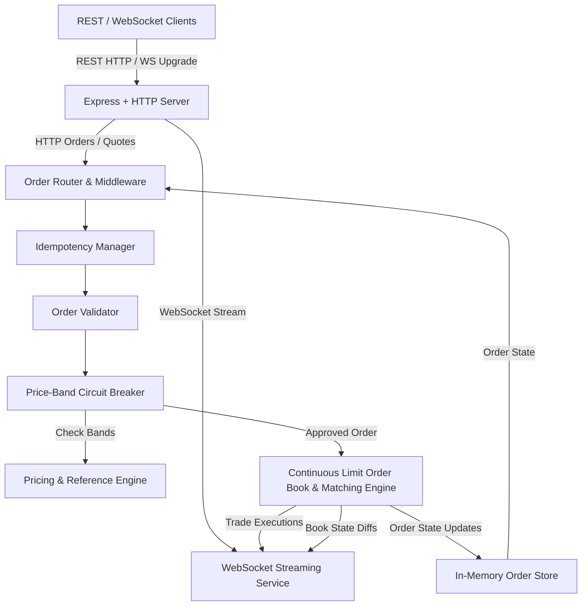

# SPEC.md: Real-Time Trade Execution Engine Specification

## 1. Executive Summary & Architecture Overview
This specification defines the architecture, API contracts, execution engine algorithms, risk controls, and non-functional requirements for extending the `order-service` into a high-performance, real-time trade execution engine optimized for volatile markets.

### System Goals
1. **Low Latency & High Throughput**: Sub-50ms p99 order acknowledgment latency with sustained throughput capacity >= 1,000 orders/second.
2. **Volatile Market Protection**: Dynamic price-band circuit breakers that reject orders violating configurable price corridors around real-time market reference prices.
3. **Idempotent Order Routing**: Exact-once order ingestion semantics via unique idempotency keys to prevent duplicate execution during network retries or client failovers.
4. **Real-Time Streaming**: High-throughput WebSocket server broadcasting real-time L2 order book updates, trade executions, and order lifecycle transitions.
5. **Zero Regression / Full Backward Compatibility**: Full compatibility with legacy REST endpoints (`POST /api/orders`, `GET /api/orders`, `GET /api/orders/:id`, `POST /api/quote`, `GET /api/health`), including legacy response shapes, fee rounding, and in-memory persistence.



---

## 2. Functional Requirements

### 2.1 Order Ingestion & Matching Engine
- **Order Model**:
  - `id`: Unique sequential identifier formatted as `ORD-XXXXXX` (6-digit zero-padded).
  - `symbol`: Ticker symbol (e.g., `AAPL`, `MSFT`, `TSLA`, `NVDA`).
  - `side`: `'buy'` or `'sell'`.
  - `qty`: Positive integer (1 to `maxOrderQty` = 10,000).
  - `price`: Positive number with up to 2 decimal places.
  - `status`: Lifecycle states: `'accepted'`, `'open'`, `'partially_filled'`, `'filled'`, `'rejected'`, `'cancelled'`.
  - `fee`: Computed maker/taker fee in integer cents/units following legacy rounding formula.
  - `filledQty`: Cumulative filled quantity (0 <= filledQty <= qty).
  - `remainingQty`: Unfilled quantity (`qty - filledQty`).
  - `createdAt`: ISO 8601 timestamp string.
  - `idempotencyKey`: Optional client-provided idempotency identifier.

- **Matching Logic (Continuous Limit Order Book - CLOB)**:
  - Supports Price-Time Priority (FIFO within price level).
  - Buy orders match against resting sell orders where `buy.price >= resting_sell.price` (execution price is the resting sell order's price).
  - Sell orders match against resting buy orders where `sell.price <= resting_buy.price` (execution price is the resting buy order's price).
  - If incoming order quantity exceeds resting liquidity at matching price levels, order is partially filled and remaining quantity rests on the book as an active limit order.
  - If incoming order matches completely, status transitions to `'filled'`.
  - If an incoming order cannot be matched immediately, status is `'open'` (or `'accepted'` for backward-compatible views) and rests in the book.

- **Trade Executions**:
  - When a match occurs, a `Trade` record is generated:
    - `id`: Unique identifier formatted as `TRD-XXXXXX` or UUID.
    - `symbol`: Ticker symbol.
    - `price`: Match execution price.
    - `qty`: Quantity filled in this execution.
    - `buyOrderId`: ID of the buy order.
    - `sellOrderId`: ID of the sell order.
    - `makerOrderId`: ID of the resting order.
    - `takerOrderId`: ID of the aggressive incoming order.
    - `timestamp`: ISO 8601 or millisecond timestamp.

### 2.2 Volatile Market Controls & Price-Band Circuit Breakers
- **Reference Price Determination**:
  - Derived from `pricingService` last traded price / mark price.
  - Dynamically updated upon every trade execution or external pricing tick.
- **Price-Band Circuit Breakers**:
  - Configurable deviation threshold `circuitBreakerBandPct` in config (default: 5.0%, representing ±5% from reference price).
  - Bounds calculated as:
    - `Lower Bound = Reference Price * (1 - bandPct / 100)`
    - `Upper Bound = Reference Price * (1 + bandPct / 100)`
  - **Validation Rule**:
    - Buy limit order price must be `<= Upper Bound`. If buy price `> Upper Bound`, reject immediately.
    - Sell limit order price must be `>= Lower Bound`. If sell price `< Lower Bound`, reject immediately.
  - Rejected orders receive status `'rejected'` and rejection reason `PRICE_OUTSIDE_CIRCUIT_BREAKER`.
- **Volatility Spike Protection (Halt Mode)**:
  - If a symbol experiences rapid price movement exceeding `maxVolatilityRatePct` (e.g., > 10% move within a 1-second rolling window), the symbol's market is placed in `'halted'` state for a configurable cooldown period (e.g., 5,000ms), rejecting new aggressive orders.

### 2.3 Idempotent Order Placement
- Clients provide an `Idempotency-Key` HTTP header (or `idempotencyKey` / `idempotency_key` in request body).
- The service maintains an in-memory idempotency cache keyed by `idempotencyKey`:
  - If a key is seen for the first time: process the order, store the resulting HTTP status code and response payload in the cache, and return the response.
  - If a duplicate key is received with an identical payload: return the cached response code and body immediately without re-executing or altering the order book.
  - If a duplicate key is received with a mismatched payload: return HTTP 422 / 400 Bad Request (`IDEMPOTENCY_PAYLOAD_MISMATCH`).
  - Concurrent requests with the same key: Ensure atomic resolution (second concurrent request awaits resolution of the first and returns the cached result).

---

## 3. API Contract

### 3.1 REST API (Fully Backward Compatible)

#### 1. Place Order
- **Endpoint**: `POST /api/orders`
- **Headers**:
  - `Content-Type: application/json`
  - `Idempotency-Key: <string>` *(optional)*
- **Request Body**:
  ```json
  {
    "symbol": "AAPL",
    "side": "buy",
    "qty": 100,
    "price": 225.50,
    "idempotencyKey": "opt-uuid-1234"
  }
  ```
- **Validation**:
  - `symbol`: String, required, must be a known/supported symbol.
  - `side`: String, required, `'buy'` or `'sell'`.
  - `qty`: Positive finite number > 0, integer <= 10,000.
  - `price`: Positive finite number > 0.
  - Circuit Breaker: Price must fall within current symbol price band.
- **Success Response** (`HTTP 201 Created`):
  ```json
  {
    "order_id": "ORD-000001",
    "status": "accepted",
    "fee": 27
  }
  ```
  *(Note: Response field names `order_id`, `status`, `fee` strictly match the legacy contract).*
- **Error Responses**:
  - `HTTP 400 Bad Request`: `{"error": "qty must be positive"}` or other validation error strings.
  - `HTTP 422 Unprocessable Entity`: `{"error": "price 250.00 exceeds circuit breaker upper limit 238.88"}`.
  - `HTTP 500 Internal Server Error`: `{"error": "<message>"}`.

#### 2. List Orders
- **Endpoint**: `GET /api/orders`
- **Success Response** (`HTTP 200 OK`):
  ```json
  {
    "orders": [
      {
        "id": "ORD-000001",
        "symbol": "AAPL",
        "side": "buy",
        "qty": 100,
        "price": 225.50,
        "status": "accepted"
      }
    ]
  }
  ```

#### 3. Get Order by ID
- **Endpoint**: `GET /api/orders/:id`
- **Success Response** (`HTTP 200 OK`):
  ```json
  {
    "id": "ORD-000001",
    "symbol": "AAPL",
    "side": "buy",
    "qty": 100,
    "price": 225.50,
    "status": "accepted",
    "fee": 27,
    "filledQty": 100,
    "remainingQty": 0,
    "createdAt": "2026-09-09T10:00:00.000Z"
  }
  ```
- **Error Response**:
  - `HTTP 404 Not Found`: `{"error": "order not found"}`.

#### 4. Price Quote (Legacy Partner Route)
- **Endpoint**: `POST /api/quote`
- **Request Body**:
  ```json
  {
    "symbol": "AAPL",
    "qty": 100
  }
  ```
- **Success Response** (`HTTP 200 OK`):
  ```json
  {
    "symbol": "AAPL",
    "price": 227.5,
    "fee": 27
  }
  ```
- **Error Response**:
  - `HTTP 500 Internal Server Error`: `{"error": "unknown symbol"}`.

#### 5. Health Check
- **Endpoint**: `GET /api/health`
- **Success Response** (`HTTP 200 OK`):
  ```json
  {
    "status": "up",
    "ts": 1725876000000
  }
  ```

---

### 3.2 WebSocket Streaming API

- **Endpoint**: `ws://<host>:<port>/ws` (or root upgrade)
- **Wire Format**: UTF-8 JSON.

#### Client-to-Server Messages

1. **Subscribe Channel**:
   ```json
   {
     "action": "subscribe",
     "channel": "orderbook" | "trades" | "orders",
     "symbol": "AAPL"
   }
   ```
2. **Unsubscribe Channel**:
   ```json
   {
     "action": "unsubscribe",
     "channel": "orderbook" | "trades" | "orders",
     "symbol": "AAPL"
   }
   ```
3. **Heartbeat / Ping**:
   ```json
   {
     "action": "ping"
   }
   ```

#### Server-to-Client Broadcast Messages

1. **Subscription Acknowledgment**:
   ```json
   {
     "type": "subscribed",
     "channel": "orderbook",
     "symbol": "AAPL",
     "timestamp": 1725876000100
   }
   ```

2. **Order Book Snapshot (`channel: "orderbook"` on subscribe)**:
   ```json
   {
     "type": "snapshot",
     "channel": "orderbook",
     "symbol": "AAPL",
     "bids": [
       [227.40, 500],
       [227.30, 1200]
     ],
     "asks": [
       [227.60, 300],
       [227.80, 800]
     ],
     "timestamp": 1725876000105
   }
   ```

3. **Order Book L2 Delta (`channel: "orderbook"` on book change)**:
   ```json
   {
     "type": "book_update",
     "channel": "orderbook",
     "symbol": "AAPL",
     "side": "buy",
     "price": 227.40,
     "qty": 600,
     "timestamp": 1725876000120
   }
   ```
   *(Note: `qty: 0` indicates price level removal).*

4. **Trade Execution Event (`channel: "trades"`)**:
   ```json
   {
     "type": "trade",
     "channel": "trades",
     "data": {
       "tradeId": "TRD-000001",
       "symbol": "AAPL",
       "price": 227.50,
       "qty": 100,
       "buyOrderId": "ORD-000001",
       "sellOrderId": "ORD-000002",
       "makerOrderId": "ORD-000001",
       "takerOrderId": "ORD-000002",
       "timestamp": 1725876000150
     }
   }
   ```

5. **Order Lifecycle Update (`channel: "orders"`)**:
   ```json
   {
     "type": "order_update",
     "channel": "orders",
     "data": {
       "orderId": "ORD-000001",
       "symbol": "AAPL",
       "status": "filled",
       "filledQty": 100,
       "remainingQty": 0,
       "price": 227.50,
       "timestamp": 1725876000155
     }
   }
   ```

6. **Heartbeat Response (Pong)**:
   ```json
   {
     "type": "pong",
     "timestamp": 1725876000200
   }
   ```

7. **Error Message**:
   ```json
   {
     "type": "error",
     "message": "Unknown symbol: INVALID"
   }
   ```

---

## 4. Non-Functional Requirements & Performance Targets

### 4.1 Latency Target: Order Acknowledgment p99 < 50ms
- **Bottleneck Resolution**:
  - Legacy code contained `legacyLedgerSync(30)` spinning the CPU synchronously for 30ms per order.
  - The fee computation is refactored into a direct, non-spinning O(1) calculation:
    ```javascript
    function computeFee(qty, price) {
      const bps = config.defaultFeeBps;
      return Math.floor((qty * price * bps) / 10000 + 0.4999);
    }
    ```
  - Eliminating the blocking spin lowers in-memory order placement latency to < 1ms mean and < 10ms p99 under standard load.

### 4.2 Throughput Target: 1,000 Orders/Second
- **In-Memory Matching Engine Data Structures**:
  - Dedicated `OrderBook` per symbol with sorted price levels.
  - Bids structured descending, Asks structured ascending.
  - Fast lookup map for orders by ID: O(1) access time.
  - Microtask-deferred / non-blocking event emission for WebSocket broadcasts to avoid event loop starvation under high order rates.

### 4.3 Idempotency & Fault Tolerance
- **In-Memory Cache with LRU / TTL eviction**:
  - Capacity: at least 100,000 keys.
  - Atomic promise locking pattern per idempotency key to safely handle rapid concurrent duplicates.

### 4.4 Price-Band Circuit Breakers for Volatile Markets
- Sub-millisecond boundary checking on every order ingress prior to matching engine entry.
- Dynamic adaptation: Reference price updates instantly when trades execute.

---

## 5. Risk Constraints & Legacy Compatibility Guarantees

| Area | Constraint / Guarantee | Mitigation Strategy |
| :--- | :--- | :--- |
| **REST Response Shapes** | `POST /api/orders` response must strictly contain `{ order_id, status, fee }`. | Preserved exact field names and types; internal engine fields (`filledQty`, `remainingQty`) exposed on `GET /api/orders/:id`. |
| **Fee Calculation** | Exact historical rounding formula: `Math.floor(qty * price * bps / 10000 + 0.4999)`. | Maintained exact arithmetic formula while removing blocking busy-wait spin. |
| **Partner Quote Route** | `POST /api/quote` must remain functional with `{ symbol, price, fee }`. | Preserved legacy route and handler in `routes/orders.js`. |
| **Storage Architecture** | In-memory storage is acceptable; persistence layer not required. | Clean modular in-memory state with fast indexing and reset helpers for testing. |
| **Process Lifecycle** | Graceful shutdown of HTTP and WebSocket servers. | `SIGTERM` / `SIGINT` handlers close WebSocket connections and HTTP server gracefully. |
